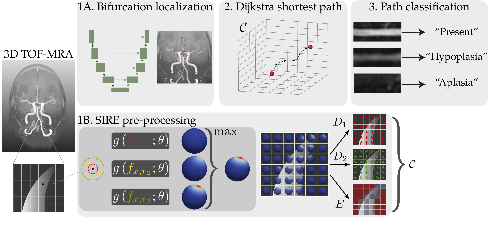

# Deep-learning based extraction of circle of Willis topology with anatomical priors

This is the code repository of our paper _Deep-learning based extraction of circle of Willis Topology with anatomical priors_.

We extract a graph representation from the circle of Willis topology from 3D TOF-MRA scans. A complete circle of Willis is used as an anatomical prior of these graphs. Therefore, we connect automatically detected bifurcation points in these scans using a shortest path algorithm, that depends on a cost function $\mathcal{C}$ based on local artery orientations. These local artery orientations are obtained through a deep-learning based, scale-invariant, rotation-equivariant estimator that operates on local image data [(SIRE)](https://arxiv.org/abs/2311.05400).

## Environment
The conda environment can be created through the `environment.yml` file:\
`conda env create -f environment.yml -n cow_extraction`\
In addition, we need the gauge-equivariant mesh convolution library (as SIRE depends on it):
```bash
git clone https://github.com/Qualcomm-AI-research/gauge-equivariant-mesh-cnn.git
cd gauge-equivariant-mesh-cnn
pip install .
```
If you get an error regarding OpenMesh, try
```bash
conda install -c conda-forge openmesh-python
```
then try to pip install again.

## Data
Data is stored in the `/data` directory, with the following structure:
```
/data
    /scans
        /<Patient ID>.nii.gz
    /bifurcations
        /<Patient ID>.npy
    /sire-weights
        /model-weights.pt
        /train.yml
```
SIRE model weights and the parameters in `/train.yml` can be downloaded from [here](https://surfdrive.surf.nl/files/index.php/s/wmQLFBQkFNVWAyQ).

## Usage
The code for automatic topology extraction is in `/scripts/extract_topology.py`. Patient ID and parameters are hardcoded in this script and can be changed there.
The figure below gives an overview of the method. `extract_topology.py` saves both the paths found by Dijkstra's algorithm (as a dictionary where the world-coordinates can be accessed through the key `'world'`). This script also saves the result of the SIRE preprocessing filter as a 9D vectorfield, with the following contents:
$[D_1(x), D_1(y), D_1(z), D_2(x), D_2(y), D_2(z), \text{entropy}, \text{max activation}, \text{max scale}]$.



## Results
Results are automatically saved in the `/results` folder after running `/scripts/extract_topology.py`. The SIRE vectorfields are saved as `.npy` files in `/results/SIRE_filtered` and a minimal intensity projection as well as the coordinates of the paths are saved as `.png` and `.pkl` files respectively under `/results/paths`.